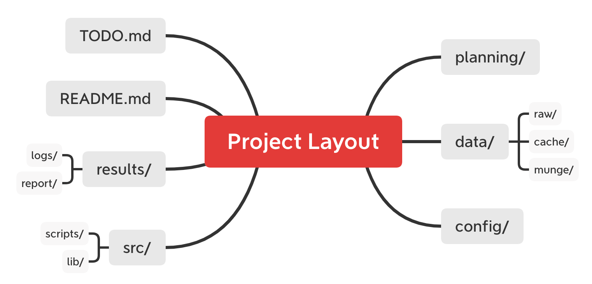

# Machine Learning Project Template



## Goal

Project layout is critical for machine learning projects just as it is for software development projects. A project layout organizes thoughts and gives you context for ideas just like knowing the names for things gives you the basis for thinking.

- **Transparency**: Logical and clear layout for the project making it intuitive for the reader.
- **Maintainability**: Easy to modify the project with standard names for files and directories.
- **Modularity**: Discrete tasks separated into separate scripts with a single responsibility.
- **Portability**: Easy to move a project to another system (relative paths and known dependencies)
- **Reproducibility**: Easily run and create the same artefacts by you in the future or another person.
- **Efficiency**: Less thought on meta project details like the tools and more on the problems you are solving.

## How to use?
```python
python create_dir.py --project_dir [path/to/your/project_root]
# For example
# python create_dir.py --project_dir /mnt/ssd2/Projects/MyFoo
```

## How does created directories look like?
```shell script
MyFoo
├── config
├── data
│   ├── cache
│   ├── munge
│   └── raw
├── results
│   ├── logs
│   └── report
├── src
│   ├── lib
│   └── scripts
├── README.md
└── TODO.md
```

**planning**: Contains miscellaneous files. It could be useful papers, vague thoughts, etc.

**data**: 

- raw. Raw data files. e.g. soft-link to my local ~/AllDataSets
- cache: Preprocessed datasets that don’t need to be re-generated every time you perform an analysis.
- munge: Preprocessing data munging code, the outputs of which are put in cache.

**config**: Contains parameter files to run scripts, e.g. .json,.yaml files. I can adjust hyperparam here. 

**src**:

- scripts. All the scripts. e.g. train.py, test.py
- lib: Helper library functions. 

**results**: 

- **logs**: Output of scripts and any automatic logging. e.g. tensorboard output.

- **reports**: Output reports and content that might go into reports such as tables. e.g. it contains Latex project.

**README**: Notes that orient any newcomers to the project.

**TODO**: list of future improvements and bug fixes you plan to make.

